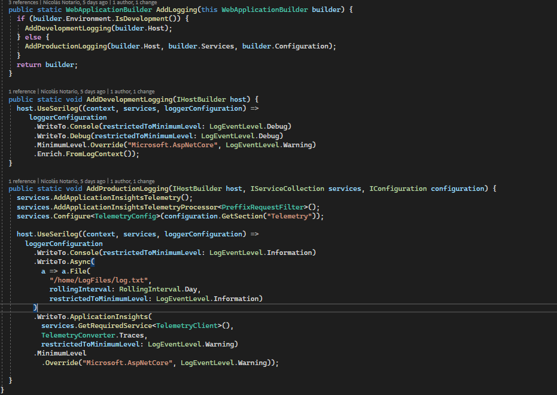

# Metodologías y procedimientos de desarrollo

### Recién llegado <a href="#_gpyyza2mro3w" id="_gpyyza2mro3w"></a>

<details>

<summary>Configuración e instalación de la máquina</summary>

La máquina se te entregará configurada por el departamento de sistemas. Habrás recibido un correo del departamento de sistemas con tus credenciales y las instrucciones a seguir para activar la verificación en dos pasos. Es **obligatorio** que cambies la contraseña por defecto tras su primer uso y actives la verificación en dos pasos.

Tendrás instalados la mayoría de los programas que utilizamos. Según el equipo en el que trabajes es posible que tengas que instalar algún programa adicional. Estos son los que seguramente tengas que instalar:

· [Fork](https://git-fork.com/): Es el cliente GIT que empleamos.

· [Postman](https://www.postman.com/downloads/): Es la plataforma que usamos para las APIs.

Por motivos de seguridad, únicamente los usuarios con permisos de administrador pueden instalar programas. Si eres becario, pregunta a tu responsable. Si no, utiliza el usuario de administrador que te habrá creado el departamento de sistemas. Queda terminantemente prohibido instalar programas sin licencia o con licencia ilegal. Tampoco se permite la instalación o ejecución de máquinas virtuales que no sean de confianza. Ante la duda, pregunta siempre a tu responsable antes de instalar cualquier cosa.

Tanto la máquina como todos los programas que utilices deberán estar en inglés. Si no vienen instalados en inglés por defecto debes instalar la versión inglesa.

</details>

<details>

<summary>Horarios y filosofía</summary>

Seguro que se te explicó en la entrevista, pero por si no lo recuerdas, aquí va un resumen:

#### Alumnos realizando prácticas en empresas <a href="#_ou88kivbbmwf" id="_ou88kivbbmwf"></a>

Las prioridades son:

1. Terminar la carrera
2. Responsabilidad y seriedad
3. Aprender y divertirte
4. Hacer bien tu trabajo

#### Nuevos contratados <a href="#_gt1oaz2bybdv" id="_gt1oaz2bybdv"></a>

1. Responsabilidad y seriedad
2. No estar nunca parado
3. Pedir ayuda cuando se necesite
4. Proactividad

El horario de entrada es a las 8:45h. Por respeto a tus compañeros, procura siempre cumplirlo. El horario de salida se establece en función de tu propia responsabilidad, solo se te exige que cumplas tus objetivos.

Siempre que te conectes a una videollamada, mantén la cámara encendida.

</details>

### &#x20;<a href="#_jivlepicku9r" id="_jivlepicku9r"></a>

### Buenas prácticas de desarrollo <a href="#_c2g9ph5l4vkr" id="_c2g9ph5l4vkr"></a>

### Logging <a href="#_hmesggbgnbkm" id="_hmesggbgnbkm"></a>

Todas las aplicaciones deben tener un log en el que al menos se indique que usuario accede a cada página.

Las recomendaciones actuales son:

* Tener diferentes configuraciones para local vs nube. En local tiene sentido disminuir el nivel mínimo de log y solo logar en consola y “debug”. En la nube, lo sensato es logar en fichero en carpeta log del servicio (d:/home/logfiles o /home/logfiles). De esta manera azure lo trata como log y lo puede incluir en la información de diagnóstico
* Utilizar Serilog para facilitar la configuración
* Añadir enlace con Application Insights con el objetivo de capturar desviaciones del comportamiento habitual (incremento en número de excepciones, de uso, etc).
* A priori no encontramos ventajas de tener la configuración de logging en el fichero de settings. En caso de tener alguna ventaja (cambiar niveles de log en tiempo real o modificar el nombre de fichero) se pueden utilizar variables de configuración

Ejemplo



### GDPR- cookies <a href="#_8y6eh62szamd" id="_8y6eh62szamd"></a>

Es imperativo cumplir con la [guía de cookies de la AEPD](https://www.aepd.es/sites/default/files/2020-07/guia-cookies.pdf). Lo mínimo, desde que haya recolección de datos (i.e. google analytics) es pedir consentimiento.

Nunca, jamás, un desarrollo de una página web que no tenga aviso legal y advertencia de cookies.

Hay un estándar para la solicitud de permisos para cookies específicas (que deberíamos incluir siempre, porque Google Analytics tiene cooke

TODOs: fijar una revisión previa jurídico-seguridad para asegurar que las aplicaciones cumplen con requisitos.

### Seguridad <a href="#_z845veknfvwn" id="_z845veknfvwn"></a>

En Braulio encontrarás dos documentos de lectura obligatoria.

1. [Desarrollo seguro](http://afinet/braulio/docsInformacionEmpleado/SGSI/ISO\_PI08.4\_DesarrolloSeguro.pdf)
2. [Política de encriptación](http://afinet/braulio/docsInformacionEmpleado/SGSI/ISO\_PI08.6\_PoliticaEncriptacion.pdf)

### Clean code <a href="#_5oabcipjldj2" id="_5oabcipjldj2"></a>

El clean code se puede definir como una metodología en el desarrollo de software que persigue, aplicando una serie de reglas, un código mucho más legible y mantenible en el futuro sin tener que preocuparse que un cambio pueda romper todos.

En esta sección se resumirán los puntos más importantes para conseguir que nuestro código se considere clean code, si quieres profundizar en la materia (que debería interesarte) se recomienda la lectura del libro Código Limpio de Robert C. Martin.

#### Variables <a href="#_mzs60y8wpfhy" id="_mzs60y8wpfhy"></a>

**Utiliza nombres de variables significativos y pronunciables**

Mal:

```
import datetime
ymdstr = datetime.date.today().strftime("%y-%m-%d")
```

Bien:

```
import datetime
current_date: str = datetime.date.today().strftime("%y-%m-%d")
```

**Evita usar distintos términos para el mismo tipo de variable**

Mal:

| <p>def get_user_info(): pass</p><p>def get_client_data(): pass</p><p>def get_customer_record(): pass</p> |
| -------------------------------------------------------------------------------------------------------- |

Bien:

| <p>def get_user_info(): pass</p><p>def get_user_data(): pass</p><p>def get_user_record(): pass</p> |
| -------------------------------------------------------------------------------------------------- |

### Gestión de versiones <a href="#_482btsda6ln" id="_482btsda6ln"></a>

Actualmente, usamos GIT para gestionar los cambios en el código de los proyectos. Los repositorios se crean en [https://dev.azure.com/afi-dev/](https://dev.azure.com/afi-dev/), en una sección posterior entraremos a explicar toda la funcionalidad aparte de los repositorios git.

Adicionalmente, se utiliza SourceSafe en proyectos que por sus características no se han portado todavía a git, pero no se generaran nuevos repositorios en este gestor de versiones.

#### GIT <a href="#_oxom2buboz93" id="_oxom2buboz93"></a>

#### SourceSafe <a href="#_ftyk0asa06k" id="_ftyk0asa06k"></a>

Esta sección solo se mantiene como recordatorio de cómo funciona este gestor de versiones en el caso que trabajemos con un proyecto que lo requiera, salvo que tengas ese requerimiento te puedes saltar esta sección.

El servidor del SourceSafe está en \\\FILESERVER\SOURCESAFE$

El control de versiones (SourceSafe) es una herramienta que guarda una copia de todos los ficheros que se almacenan en él y lleva un control de los cambios que hay entre diferentes versiones.

La estructura del control de versiones es un árbol de proyectos. Los proyectos son equivalentes a los directorios de tu disco duro. De hecho, puedes suponer que, en general, la raíz del control de versiones coincide con tu directorio E:\ (en la primera instalación, pulsa sobre el directorio raíz del SourceSafe con el botón derecho, selecciona set working folder, y elige E:\\).

Para subir algo al control de versiones, puedes hacerlo de dos formas:

1\. Arrastrándolo directamente un proyecto del control de versiones (proyecto = directorio).

2\. En un proyecto de visual basic, él te pregunta, di que si, y selecciona en el control de versiones un directorio que se llame igual que el de tu disco duro, y esté ubicado en el mismo lugar.

Tú eres quien decide cuando quieres almacenar nuevos cambios en un fichero, de la siguiente forma:

1\. Check-out: cuando un fichero está alojado en el control de versiones y quieres hacer alguna modificación, primero tienes que bajarlo a tu máquina, con este comando, siempre que no haya otro usuario tocándolo (lo sabrás por el icono rojo junto al nombre del fichero, y porque la columna de usuario representará a quien lo esté modificando). La acción de check-out baja a tu máquina la última versión del fichero y le da permisos de escritura, para

que puedas modificarla.

2\. Check-in: cuando hayas terminado de modificar el fichero, debes informar al control de versiones, haciendo un check-in. Esto almacena tu última versión, de forma que otros puedan bajarla. Además, quita los permisos de escritura en tu máquina para que no modifiques código saltándote el control.

3\. Get latest version: baja a tu máquina la última versión de un fichero, pero no te lo deja modificar.

4\. Show history: te permite ver el histórico de versiones almacenadas. Es útil sobre todo para comparar qué cambios ha habido en caso de que algo deje de funcionar. Para ver los cambios, tienes que seleccionar las dos versiones que quieras comparar y pulsar sobre el botón Diff.

Normas muy importantes

Para evitar problemas que pueden llegar a ser irreparables, es fundamental que cumplas las siguientes normas:

1\. Nunca te des permisos de escritura en un fichero, sin haber hecho previamente check-out. Al hacerlo, puedes suponer (tú o un compañero que utilice tu máquina) que la versión del fichero es buena, y trabajar en un fichero que luego se machaque por un get latest version o un check out. El único caso en el que puedes darte derechos de escritura es en los ficheros .vbp, siempre que no vayas a hacer cambios sobre ellos.

2\. Sube sólo versiones de código que funcionen, no subas nunca nada a medias, porque alguien podría bajárselo y hacer que su versión de desarrollo no pueda funcionar.

3\. Procura subir al control de versiones todo lo que hayas estado modificando durante el día, de forma que sirva como copia de seguridad. Si te vas de vacaciones o vas a faltar algunos días a la oficina (por exámenes, por ejemplo) no dejes hecho check-out de ningún fichero. Si fuera necesario pregunta a tu responsable y/o compañeros.

4\. No muevas ficheros de un sitio a otro ni crees "shares". En caso de necesitar hacerlo, consulta con un responsable.

5\. No metas ni espacios en blanco ni tildes en los nombres de los directorios.

6\. No crees directorios de aplicaciones web fuera del directorio WEB.

7\. No crees directorios de aplicaciones java fuera del directorio JAVA.

8\. Si tienes duda acerca de dónde crear un directorio, pregunta.

9\. Si vas a cambiar de máquina y alguna vez has trabajado con el SourceSafe, revisa que no tengas hecho check-out de algún fichero en la máquina vieja

### Análisis de código con SonarQube <a href="#_lp6in1dyk0mx" id="_lp6in1dyk0mx"></a>

En Afi disponemos de dos opciones para analizar el código:

* SonarQube local en sonarqube.afi.es (solo acceso local)
* SonarQube Cloud, que incluye análisis de ramas diferentes a master

Para el análisis de SonarQube en cloud, ya que el coste del servicio se base en número de lineas de código, es necesario tener en cuenta los siguientes puntos:

* No realizar análisis de proyectos que no estén en desarrollo activo.
* No incluir código generado automáticamente como por ejemplo migrations EF
* No incluir código de librerías externas como bootstrap

### &#x20;<a href="#_10zs0s5w9faa" id="_10zs0s5w9faa"></a>

### Infraestructura <a href="#_ozngy042farp" id="_ozngy042farp"></a>

Intentar seguir los principios de “infrastructure as code”, es decir, evitar la creación manual de infraestructura y fomentar el uso de ficheros de definición de infraestructura. Para ello las opciones que utilizamos actualmente son [templates arm de Azure](https://docs.microsoft.com/en-us/azure/azure-resource-manager/templates/overview), [terraform ](https://registry.terraform.io/)y [biceps](https://docs.microsoft.com/es-es/azure/azure-resource-manager/bicep/overview).

Importante, intenta distinguir lo que es la configuración de la infraestructura de la configuración de la aplicación.

Ejemplo: la cadena de conexión a la base de datos es configuración de la infraestructura pero

Alertas

Es importante saber cuando alguno de tus desarrollos falla y poder solucionar el problema antes incluso de que el cliente lo detecte. Para nuestras herramientas online puede usar los [Availability Tests](https://docs.microsoft.com/en-us/azure/azure-monitor/app/availability-overview) de Azure

### Conexion con APIs de terceros <a href="#_ud2oa4a7xqe1" id="_ud2oa4a7xqe1"></a>

#### Biblioteca Polly - Manejo de reintentos y recuperación <a href="#_7ck4ldya9tcx" id="_7ck4ldya9tcx"></a>

La biblioteca Polly es una herramienta poderosa y flexible para manejar reintentos y recuperación en aplicaciones desarrolladas con C#. Proporciona un enfoque sencillo y eficaz para lidiar con errores temporales o transitorios en operaciones críticas, como llamadas de red o acceso a bases de datos. Al integrar Polly en tus metodologías de trabajo, puedes mejorar significativamente la resiliencia y confiabilidad de tus aplicaciones.

A continuación, exploraremos los principales aspectos de Polly y cómo utilizarlo de la mejor manera:

1. Instalación e integración: Para comenzar a utilizar Polly, debes agregar su paquete NuGet a tu proyecto C#. Puedes hacerlo a través del administrador de paquetes de Visual Studio o mediante la línea de comandos. Una vez instalado, Polly se convierte en una herramienta disponible para manejar los reintentos en tu aplicación.
2. Definición de políticas: En Polly, las políticas definen cómo y cuándo se deben realizar los reintentos. Puedes crear políticas personalizadas que se adapten a las necesidades específicas de tu aplicación. Por ejemplo, puedes especificar la cantidad máxima de reintentos, el intervalo entre los reintentos, el tipo de excepciones que deben ser consideradas como errores, entre otros. Al definir tus políticas de manera clara, puedes controlar el flujo de reintentos y ajustarlo a los requisitos de tu aplicación.
3. Gestión de excepciones: Una de las ventajas de Polly es su capacidad para manejar diferentes tipos de errores y excepciones. Puedes configurar políticas para capturar excepciones específicas y tomar acciones adecuadas en función de ellas. Por ejemplo, puedes definir acciones personalizadas para manejar errores de red, como reintentar después de un tiempo determinado o registrar información de error detallada. Esta capacidad de gestión de excepciones te permite adaptar la respuesta de tu aplicación según el tipo de error encontrado.
4. Estrategias avanzadas de reintentos: Polly ofrece estrategias de reintentos avanzadas que pueden mejorar aún más la resiliencia de tu aplicación. Por ejemplo, puedes utilizar esperas exponenciales, donde el intervalo de tiempo entre los reintentos aumenta de manera exponencial, lo que ayuda a reducir la carga en sistemas externos y evita congestiones. También puedes usar esperas aleatorias para evitar patrones predecibles de reintentos y mejorar la tolerancia a fallas.
5. Pruebas y ajustes: Una vez que hayas definido tus políticas de reintentos en Polly, es importante realizar pruebas exhaustivas para asegurarte de que se comporten como se esperaba. Actúa pruebas tanto en escenarios normales como en situaciones de errores simulados para verificar que los reintentos y las acciones de recuperación se actúen correctamente. A medida que identifiques posibles mejoras o ajustes, actúa las modificaciones necesarias para optimizar el comportamiento de Polly en tu aplicación.

Al utilizar Polly de manera efectiva, puedes agregar una capa adicional de robustez a tus aplicaciones, permitiendo una mejor tolerancia a fallas y una recuperación más

[https://github.com/App-vNext/Polly](https://github.com/App-vNext/Polly)

https://github.com/Polly-Contrib/Polly.Contrib.WaitAndRetry

#### Trazas <a href="#_qo8d0bpsugx6" id="_qo8d0bpsugx6"></a>

1. Configuración del sistema de registro: Asegúrate de tener un sistema de registro configurado en tu aplicación antes de utilizar Polly. Puedes utilizar bibliotecas populares de registro en C#, como log4net, NLog o Serilog. Configura el nivel de registro adecuado según tus necesidades, como información, advertencias y errores.
2. Registro de intentos y acciones: Al definir tus políticas de reintentos en Polly, incluye registros que indiquen cuándo se realiza un reintentos y qué acciones se toman en cada intento. Registra información relevante, como el número de intento, el tipo de excepción capturada y cualquier detalle adicional que pueda ser útil para el análisis posterior.
3. Registro de resultados exitosos y fallidos: Después de que se complete una operación exitosamente o se agoten los reintentos sin éxito, registra el resultado final. Esto ayudará a tener una visión clara de cuántas veces se logró la operación y cuántas veces falló. Incluye detalles como el tiempo total requerido y cualquier información adicional que pueda ser útil para el seguimiento y la depuración.
4. Información contextual: Asegúrate de incluir información contextual relevante en los registros. Esto puede incluir detalles sobre el contexto de la operación, como el identificador del usuario, el nombre del método o la ruta de la solicitud. Estos detalles pueden ayudar a identificar y rastrear problemas específicos en el flujo de la aplicación.
5. Registros de excepciones: En caso de que se capturen excepciones durante los reintentos, registra información detallada sobre las excepciones, como el tipo de excepción, el mensaje de error y la pila de llamadas. Esto facilitará la identificación y el diagnóstico de problemas específicos relacionados con errores o excepciones en las operaciones.
6. Niveles de registro adecuados: Utiliza los niveles de registro adecuados para registrar diferentes tipos de información. Por ejemplo, puedes emplear el nivel de registro “Información” para registrar detalles sobre cada reintento, mientras que puedes emplear el nivel de registro "Error" para registrar excepciones no controladas o fallas en los reintentos.
7. Contexto de registro global: Considera establecer un contexto de registro global en tu aplicación, si es compatible con la biblioteca de registro que estás usando. Esto te permitirá agregar información adicional automáticamente a todos los registros generados por Polly, como el nombre de la política o cualquier otra información global relevante.
8. Análisis y seguimiento: Una vez que hayas implementado los registros con Polly, asegúrate de revisarlos y analizarlos de manera regular. Esto te ayudará a identificar patrones, problemas recurrentes o mejoras potenciales en tu aplicación. Usa herramientas de análisis de registros o herramientas de monitoreo para obtener información valiosa sobre el comportamiento de Polly y cualquier impacto en tu aplicación.

Recuerda que los registros adecuados y detallados pueden ser una herramienta invaluable para el análisis, el seguimiento y la resolución de problemas en tu aplicación.

#### Mensajes de error personalizados <a href="#_8aomvf8m9hb" id="_8aomvf8m9hb"></a>

La idea es dar la percepción al usuario que el servicio nuestro no está fallando, lo que falla es la api del tercero.

### NORMAS DE SEGURIDAD <a href="#_lrxjjis15hwo" id="_lrxjjis15hwo"></a>

1. Enfoque de mínimo privilegio
   1. Permisos solo para lo que se necesita
   2. No usar secretos en texto plano
   3. Rotación de claves
   4. Fallo por defecto
2. Control de acceso
   1. Identidades manejadas
   2. Uso de KeyVault
3. Recursos compartidos
   1. No todos a una, mejor uno para cada uno
   2. Si es necesario, compartir las claves KeyVault
4. Autentificacion utilizando el standard
   1. OpenId
   2. JWT
   3. AzureAD

### &#x20;<a href="#_7ejn6rwvgiek" id="_7ejn6rwvgiek"></a>
